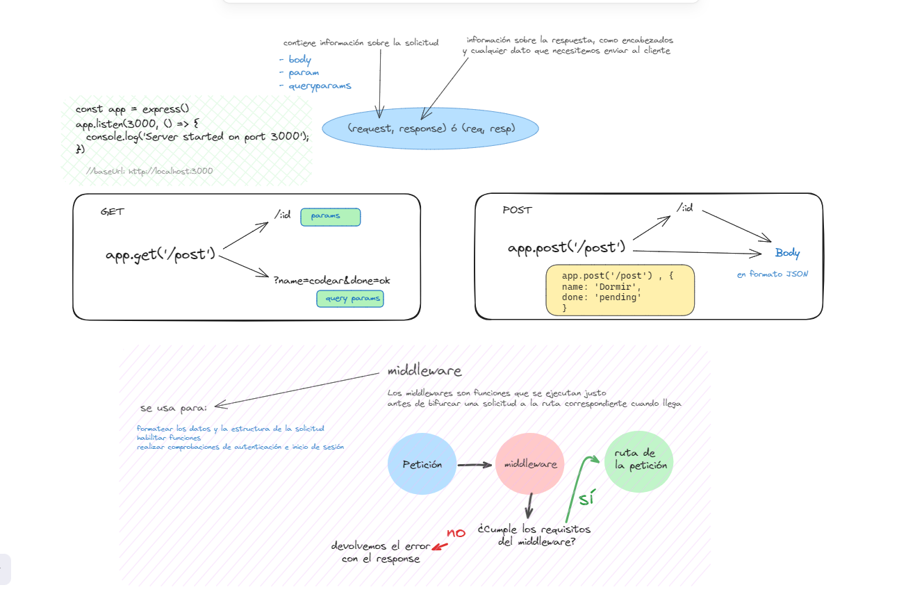

## Recursos y Herramientas Utilizadas 🤯

### Express ⚡

- **Express** - El marco de trabajo web para Node.js que facilita la creación de aplicaciones web y APIs. Para más detalles, visita el sitio oficial de Express:
  - [Sitio web de Express](https://expressjs.com/)

### NPM Packages 🎁

- **express** - El paquete principal de Express, que nos proporciona las funcionalidades básicas del marco de trabajo.
  - [express en NPM](https://www.npmjs.com/package/express)

- **nodemon** - Una herramienta que ayuda en el desarrollo de aplicaciones basadas en Node.js al reiniciar automáticamente la aplicación cuando se detectan cambios en los archivos del proyecto.
  - [nodemon en NPM](https://www.npmjs.com/package/nodemon)

- **morgan** - Un middleware de registro de solicitudes HTTP para Node.js, que facilita el seguimiento de las solicitudes y respuestas en nuestra aplicación.
  - [morgan en NPM](https://www.npmjs.com/package/morgan)

## Inicio 🪄

Comenzamos ejecutando con `node`.
Cuando tengamos nodemon lo haremos con `nodemon`

## Collab 👨‍💻

👉 [Adasat](https://github.com/Adasat)

👉 [Iratze](https://github.com/IraEiza)

## Explicación 🎨

